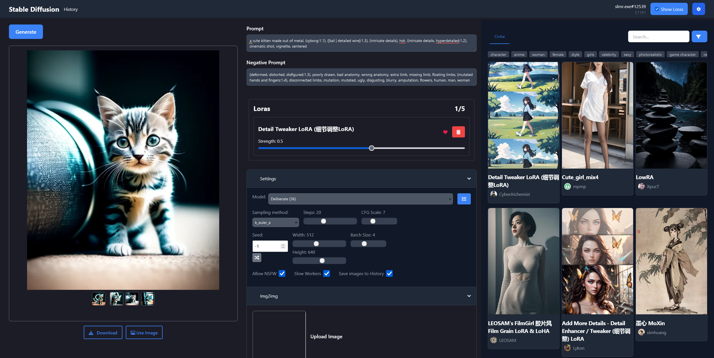
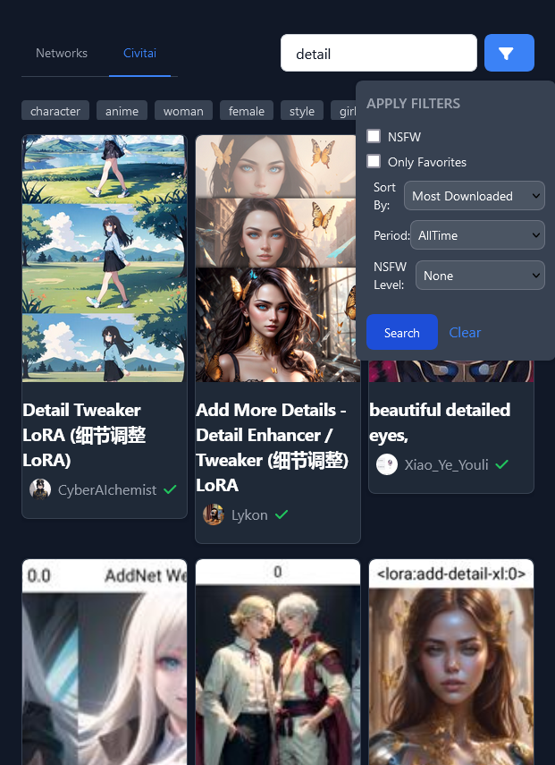
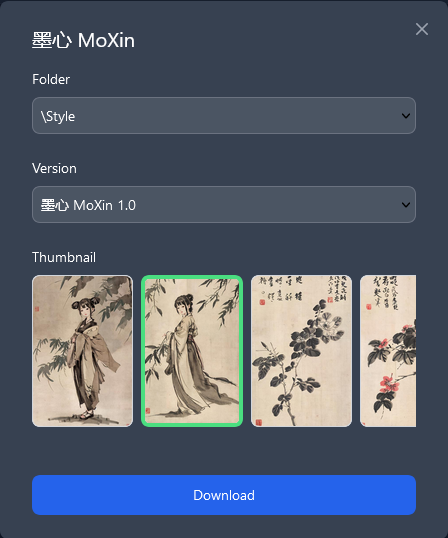

# Online UI For Stable Diffusion

A user-friendly web interface for generating images using Stable Diffusion, offering multiple options including AI Horde, Automatic1111, and Comfyui integrations. 

## Features

- Image Generation with Multiple Options
- img2img and Inpainting Capabilities
- Upscaling
- Integration with AI Horde, Automatic1111, and Comfyui
- Image Gallery for Easy Access
- Civitai Integration

## AI Horde

Generate images using [AI Horde](https://aihorde.net), a distributed cluster of Stable Diffusion workers, making this tool accessible to users without powerful GPUs.

1. Visit [AI Horde Registration](https://aihorde.net/register) and obtain your Token.
2. In the settings, choose AI Horde.
3. Paste your Token in the Token field.
4. Start Generating.

## Automatic1111

Connect to your local instance of [Automatic1111](https://github.com/AUTOMATIC1111/stable-diffusion-webui) to generate images.

1. Launch Automatic1111 with the arguments `--api --cors-allow-origins=*`.
2. In the settings, select Automatic1111.
3. Enter the URL of your Automatic1111 instance.
4. Start Generating.

## Comfyui

Connect to your local instance of [Comfyui](https://github.com/comfyanonymous/ComfyUI) to generate images. (Note: Comfyui support is still a work in progress)

1. Start Comfyui with launch arguments `--enable-cors-header*`.
2. In the settings, choose Comfyui.
3. Enter the URL of your Comfyui instance.
4. Start Generating.

## Civitai Sidebar

You can use and download Loras from [civitai.com](https://civitai.com).

### Horde

When using AI Horde, select any Lora from civitai.com from the sidebar. Keep in mind that using Loras might extend the generation time as the worker may need to download them from civitai.com first.

### Automatic1111

To use Civitai Loras with Automatic1111, install the [Civitai API](https://github.com/slimerplanet/sd-webui-civitai-api) extension. This allows you to download Loras from civitai.com. After you have installed the extension, enable "Allow Downloading Models From Civitai" in the settings.

When you click on a Lora that hasn't been downloaded yet, a modal will appear, asking you which version to download and where to save it. After downloading, you can use it to generate images.

